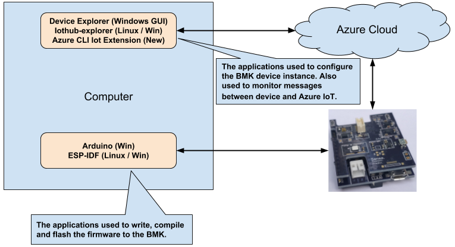
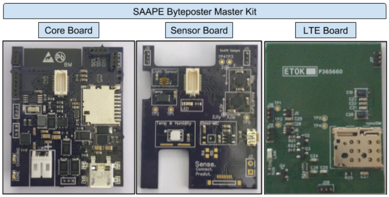
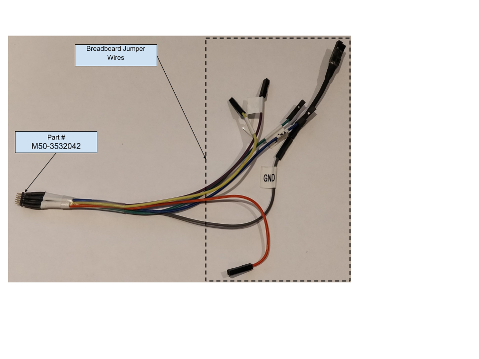
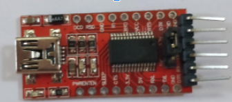
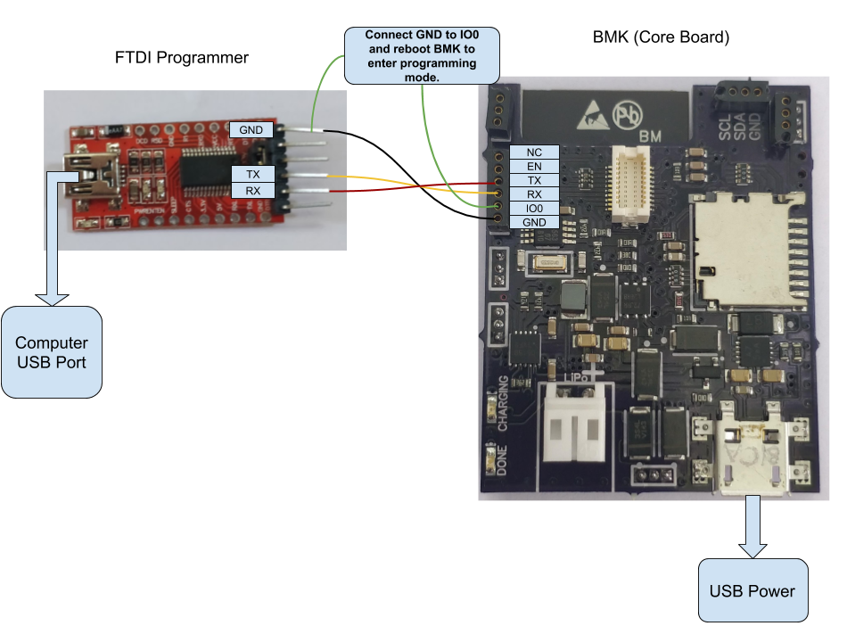

SAAPE - Byteposter Master Kit Starter Guide 
===
---
platform: rtos
device: esp-wroom-32
language: c
---

Azure Demo code for BMK (ESP-WROOM32) device.
===
---

# Table of Contents
-   [Introduction](#Introduction)
-   [Step 1: Prerequisites](#Prerequisites)
-   [Step 2: Connect BMK to Computer](#programming-prepare)
-   [Step 3: SDK and Tools Preparation](#tools-prepare)
-   [Part 4: Configuring and building](#config-build)
-   [Part 5: Result shows](#results)
-   [TroubleShoot](#troubleshoot)
-   [Next Steps](#NextSteps)

<a name="Introduction"></a>
# Introduction

- BytePoster Master Kit (BMK) is an IoT platform allowing engineers to prototype, proof of concept and develop IoT products at an extremely fast pace. The BMK contains three boards: Core, Sensor, and GSM. Additionally, BMK can accept additional custom boards for specific feature or capability.
- The Core board contains an Xtensa® Dual-core 32-bit LX6 microprocessors (WiFi/BLE), standalone timer, battery management and battery charging. Additionally, the capability to store information on SD card. For more information regarding the microcontroller: <https://espressif.com/en/products/hardware/esp32/overview>
- The sensor board contains multiple sensors (Temperature and Humidity, High Precision Temperature, 3D Digital Linear Acceleration Sensor, 3D Digital Magnetic Sensor, 3D Accelerometer and 3D Gyroscope, Hi-Sensitivity Ambient Light Sensor, PIEZO ZeroPower Microphone), and the ability to accept any sensor via I2C, ADC, and SPI protocols.
- The dedicated GSM board for low power LTE connectivity, specially optimized for M2M and IoT applications. This board can be snapped on to the core board of the BMK. It has a Quectel  EC21 chipset on board with a power circuitry to utilize cellular connectivity for real time monitoring applications with power constraints. The BMK delivers M2M optimized speeds of 10Mbps downlink and 5Mbps uplink. 
This kit is designed for enterprises to rapidly realize their ideas; create a custom end to end solutions for their clients and accelerate their process of going from prototype stage to pilot stage. 


Azure cloud is one of wonderful cloud that could collect data from lot device or push data to lot device,for more details, click <https://www.azure.cn/home/features/iot-hub/>

**Aim:**

This page would guide you connecting your BMK device to Azure by MQTT protocol, and then send temperature (requiers sensor board) data to Azure.Main workflow:
 
 
<a name="Prerequisites"></a>
# Step 1: Prerequisites

You should have the following items ready before beginning the process:

-   **Ubuntu environment** (ESP-IDF) or Windows environment (Arduino or ESP-IDF) for building your demo.
    We recommend the Linux enviorment with the latest ESP-IDF option. Please click on the link <https://docs.espressif.com/projects/esp-idf/en/latest/get-started/>
-   Create IoT-Hub instance in Azure [Follow: "Setup an Azure Iot Hub"][lnk-setup-iot-hub] 
-   Device credentials (Provisioning).
       There are multiple ways to create an device and its creatednital. We recommend using the Windows Device Explorer option. [Follow:"Option 1: Use Azure IoT Hub DeviceExplorer (Windows Only)"][lnk-manage-iot-hub]
-   **BMK device** for running the demo.  
    
-   **Programming Header** for easy programing. Optional but recommended.
    You can build one using [header] and some jumper wire. 
    
-   **FTDI Programmer** to connect computer to BMK Core board.  
    

<a name="programming-prepare"></a>
# Step 2
1. Connect the FTDI Programmer to your computer via USB and install the drivers. 
   
2. Connect the BMK Core Board via the usb to a computer port (This connection is to power on the BMK or charge the battery). 

3. Connect the FTDI programmer and the BMK per the diagram below. 


4. If you want to flash code into the board, make sure to connect the "IO0" pit to "GND" and reboot the board. Once, code has been uploaded remove the "IO0" to "GND" connection and reboot the board. 


<a name="tools-prepare"></a>
# Step 3: SDK and Tools Preparation

### BMK Demo get

-   You can get BMK-Demo (ESP-IDF)  from <https://github.com/SaapeDesignsInc/BytePoster-Master-Kit/tree/master/example/ESP-IDF/BMK_Azure_Temp> to connect BMK to Azure by MQTT protocol and send temperature. Additionally, the Arduino demo is avaliable here:<https://github.com/SaapeDesignsInc/BytePoster-Master-Kit/tree/master/example/Arduino/BMK_Azure_Demo>
-   Download the BMK_Azure_Demo project.
-   You can get AZURE-SDK from <https://github.com/ustccw/AzureESP32> to connect ESP32 to Azure by MQTT protocol.  
-   You can get IDF-SDK from <https://github.com/espressif/esp-idf>. This SDK can make ESP32 work well.


<a name="config-build"></a>
# Step 4: Configuring and building

### Update Variables

[/BML_Azure_Demo/main/main.cpp](#)

-   Update the connectionString variable to the device-specific connection string you got earlier from the Setup Azure IoT step:

    ```
    static const char* connectionString = "[azure connection string]"
    ```

-   The azure connection string contains Hostname, DeviceId, and SharedAccessKey in the format:

    ```
    "HostName=<host_name>;DeviceId=<device_id>;SharedAccessKey=<device_key>"
    ```
-   Configure the SSID and password for your wireless network:

    ```
    const char* ssid     = "insert_ssid";
    const char* password = "insert_password";
    ```
    

### Config your project

    ```
    make menuconfig
    
    Arduino Configuration ->include only specific Arduino libraries -> 
    *AzureIoT
    *ESP32
    *HTTPClient
    *SPI
    *Wifi
    *WifiClientSecure
    *Wire
    
    Se
    ```

- ### Build your demo and flash to ESP32
 
    ```
    $make flash
    ```

-   If failed,try:
    -   make sure that ESP32 had connect to PC by serial port 
    -   make sure you flash to correct serial port
    -   try type command:
        > sudo usermod -a -G dialout $USER
 
<a name="results"></a>
# Step 5: Result shows

-   Start the DeviceExplorer -> Click on Data tab.
-   Select the Device you created under Device ID and click "Monitor"
-   Restart the BMK device (You can press the restart button. Make sure the gorund is not connected to the IO0 pin) after bin had flashed. You would see the temperaturedata in the "EventHub Data" window.


<a name="troubleshoot"></a>
#TroubleShoot

-   Close some firewall settings
-   Build failed, try:
    -   git submodule init
    -   git submodule update
    -   export your compiler path 
    -   export your SDK path
    -   get start with <http://espressif.com/en/support/download/documents?keys=&field_type_tid%5B%5D=13>
    -   make sure you had input correct device connection string

<a name="NextSteps"></a>
# Next Steps

You have now learned how to run a sample application that collects sensor data and sends it to your IoT hub. To explore how to store, analyze and visualize the data from this application in Azure using a variety of different services, please click on the following lessons:

-   [Manage cloud device messaging with iothub-explorer]
-   [Save IoT Hub messages to Azure data storage]
-   [Use Power BI to visualize real-time sensor data from Azure IoT Hub]
-   [Use Azure Web Apps to visualize real-time sensor data from Azure IoT Hub]
-   [Weather forecast using the sensor data from your IoT hub in Azure Machine Learning]
-   [Remote monitoring and notifications with Logic Apps]   

[Manage cloud device messaging with iothub-explorer]: https://docs.microsoft.com/en-us/azure/iot-hub/iot-hub-explorer-cloud-device-messaging
[Save IoT Hub messages to Azure data storage]: https://docs.microsoft.com/en-us/azure/iot-hub/iot-hub-store-data-in-azure-table-storage
[Use Power BI to visualize real-time sensor data from Azure IoT Hub]: https://docs.microsoft.com/en-us/azure/iot-hub/iot-hub-live-data-visualization-in-power-bi
[Use Azure Web Apps to visualize real-time sensor data from Azure IoT Hub]: https://docs.microsoft.com/en-us/azure/iot-hub/iot-hub-live-data-visualization-in-web-apps
[Weather forecast using the sensor data from your IoT hub in Azure Machine Learning]: https://docs.microsoft.com/en-us/azure/iot-hub/iot-hub-weather-forecast-machine-learning
[Remote monitoring and notifications with Logic Apps]: https://docs.microsoft.com/en-us/azure/iot-hub/iot-hub-monitoring-notifications-with-azure-logic-apps
[lnk-setup-iot-hub]: http://thinglabs.io/workshop/thingy-4-windows/setup-azure-iot-hub/
[lnk-manage-iot-hub]: http://thinglabs.io/workshop/thingy-4-windows/setup-azure-iot-hub/
[header]: https://www.mouser.com/ProductDetail/Preci-dip/851-87-006-10-001101?qs=5EuvDXACa6v9%252BVLvAWkDjA%3D%3D#.XJVJqslZ8GY.link

